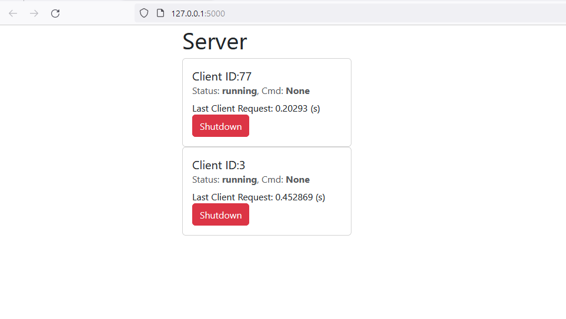

# Client / Server example to control python scripts on remote devices 

This is a simple client server demonstration to control python scripts on remote devices. The server can send commands to the clients and the clients can send back the results. 

The server is written with flask (http://flask.pocoo.org/) and the clients are written with requests (http://docs.python-requests.org/en/master/).

The dashboard web page uses htmx (https://htmx.org/) for dynamic display/refresh of the clients.

## Installation

### Create python venv and activate it

```bash
python -m venv venv
venv\Scripts\activate
```

### Install requirements
```bash
pip install -r .\requirements.txt
```

### Run server
in its own terminal
```bash
python server.py
```

### Run multiple clients
each client in a seperate terminal
```bash
#with random id
python client.py

#with specific id
python client.py --id 1
```

### Open dashboard
Open http://localhost:5000/ in your browser

should look like this:

